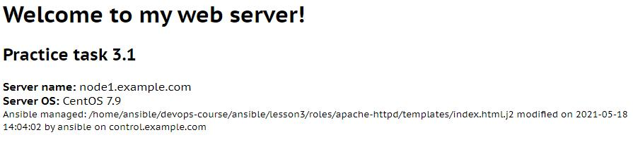

apache-httpd Ansible role
=========

Installs Apache web-server, create index page, open ports.

Example of index page
--------------

Role Variables
--------------
|Variable|Default Value|Defined in|Description|
|--|--|--|--|
|**practice_task:**|*3.1*|apache-httpd/vars/main.yml|defines practice task number, displayed on index page|
|**indexpage_path:**|*/var/www/html*|apache-httpd/defaults/main.yml|defines default path, where index page will be placed|

Example Playbook
----------------

An example of how to use this role:

    - hosts: servers
      roles:
         - apache-httpd

License
-------

Unlicense

Author Information
------------------

Yaroslav Rutsky [mail@example.com]
